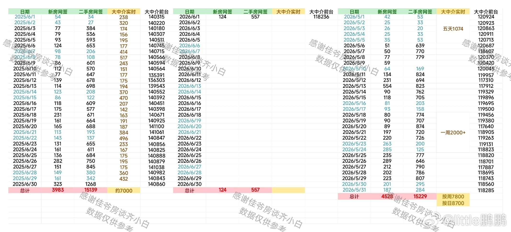
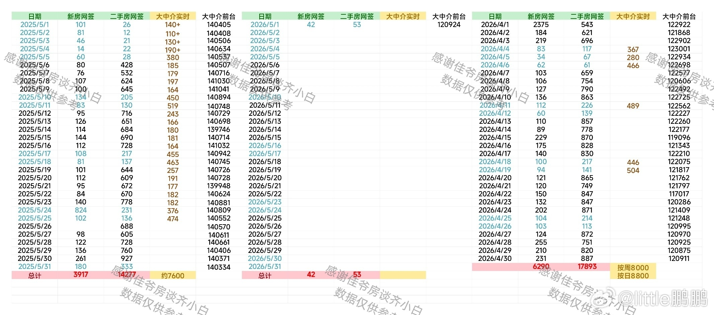
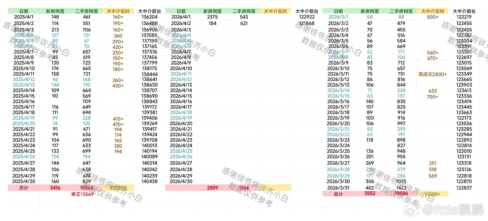
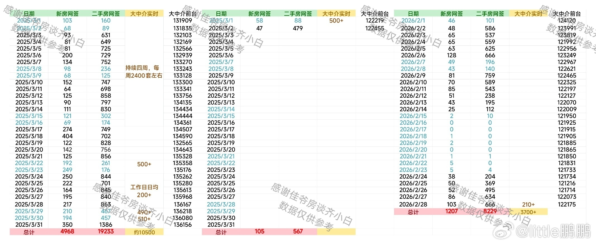
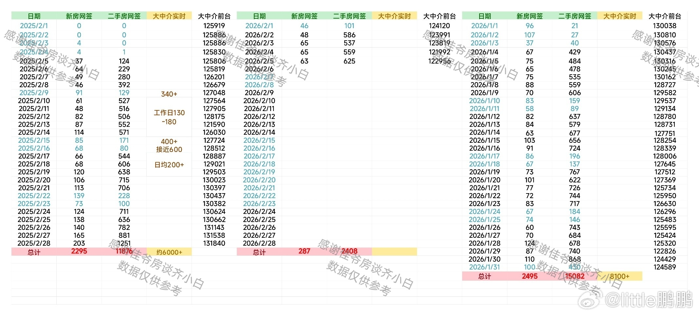

# 房价走势月度目录

> 按月份归档房价走势图片。新增月份时，把图片放到 `images/` 目录，并在下方复制一段“月份卡片”即可。

## 快速索引

| 月份 | 图片 | 备注 |
| --- | --- | --- |
| [2026 年 5 月](#2026-年-5-月) | [2026-5.jpg](./images/2026-5.jpg) | 已归档 |
| [2026 年 4 月](#2026-年-4-月) | [2026-4.jpg](./images/2026-4.jpg) | 已归档 |
| [2026 年 3 月](#2026-年-3-月) | [2026-3.jpg](./images/2026-3.jpg) | 已归档 |
| [2026 年 2 月](#2026-年-2-月) | [2026-2.jpg](./images/2026-2.jpg) | 已归档 |
| [2026 年 1 月](#2026-年-1-月) | [2026-1.jpg](./images/2026-1.jpg) | 已归档 |

## 月度走势

### 2026 年 5 月



**文件：** `2026-5.jpg`  
**建议记录：** 新房网签、二手房网签、大中介实时、大中介前台等指标。

---

### 2026 年 4 月



**文件：** `2026-4.jpg`  
**建议记录：** 新房网签、二手房网签、大中介实时、大中介前台等指标。

---

### 2026 年 3 月



**文件：** `2026-3.jpg`  
**建议记录：** 新房网签、二手房网签、大中介实时、大中介前台等指标。

---

### 2026 年 2 月



**文件：** `2026-2.jpg`  
**建议记录：** 新房网签、二手房网签、大中介实时、大中介前台等指标。

---

### 2026 年 1 月



**文件：** `2026-1.jpg`  
**建议记录：** 新房网签、二手房网签、大中介实时、大中介前台等指标。

---

## 新增月份模板

复制下面这段，把月份和图片文件名替换掉：

```md
### 2026 年 6 月


**文件：** `2026-6.jpg`  
**建议记录：** 新房网签、二手房网签、大中介实时、大中介前台等指标。

---
```
